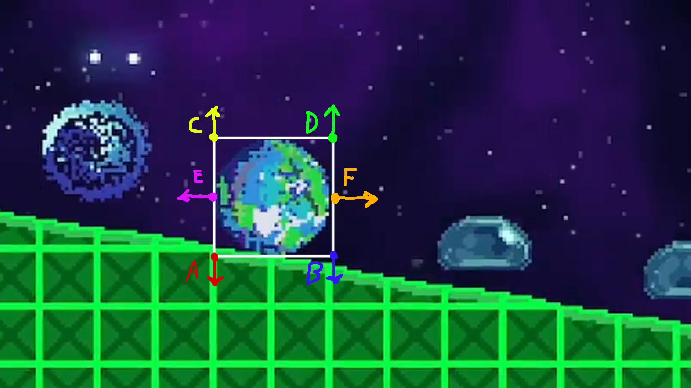
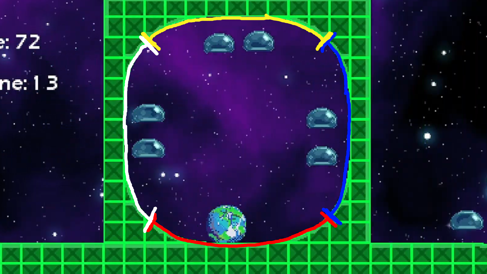
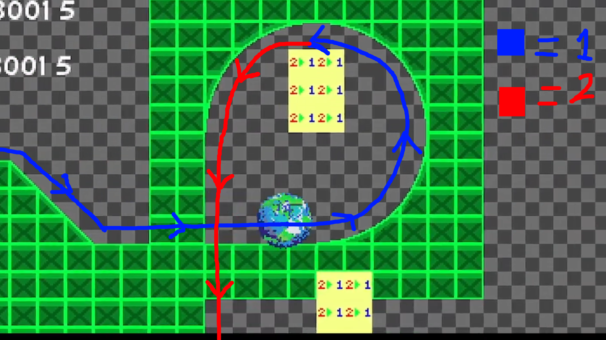

# EarthFlame
This is a project I developed for the Great Warwick Game Jam 2024. The game is a momentum-based 2D platformer inspired by the Sonic the Hedgehog games.

Watch a showcase of the game by clicking the image below!

## Sensors
The player has 6 sensors:
- Floor Sensors (A, B)
- Ceiling Sensors (C, D)
- Push Sensors (E, F)

Each sensor is able to **extend** (to find solid terrain further away) or **regress** (to find closer terrain).
Extension is primarily used to find terrain whilst airborne.
Regression is primarily used correct if the player has found themselves **in** the terrain.

Each sensor has an associated direction that they look for terrain in.
For each category of sensor, the winning sensor is determined by the one which has found the closest terrain.
The winning sensor's data will be used to guide collision.

## Collision
Every tile has an associated angle and height array. The angle, as expected, is used to determine the direction of the slope. The height array stores the per-pixel height of each column in the tile. Floor and ceiling sensors make use of the height array.
The height array is also transformed into a width array through some rotations. Wall sensors make use of the width array.

If a sensor has collided with a tile, the tile's height at the sensor's position is used to correct the player's position.

## Collision Modes
How is running up walls and along the ceiling handled? We need to be able to treat the walls, ceiling, and floors interchangeably. This is done by using several "collision modes", determined by the angle of the terrain.

Based on the following ranges (in degrees):
- Floor Mode (315 - 45)
- Right Wall Mode (45 - 135)
- Ceiling Mode (135 - 225)
- Left Wall Mode (225 - 315)

In each mode, the position and direction of the sensors change. If in floor mode, the floor sensors point down, then in right wall mode the floor sensors will now point right. The associated array also changes (height -> width). This essentially allows the collision system to treat any direction as the "ground" direction.

## Layer Switching
To pass through a loop-de-loop, there needs to be a foreground and background layer. How is it determined when the player switches layer?

There are "layer switch" tiles. These tiles act as triggers, allowing the player to switch between the foreground and background.

The player must fulfil two conditions for these triggers to activate:
- They must be on the corresponding layer to the side of the trigger they are on.
- They must pass through the layer in the correct direction.
